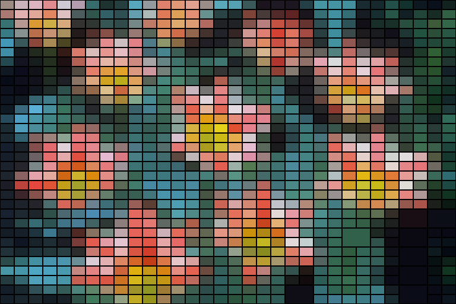
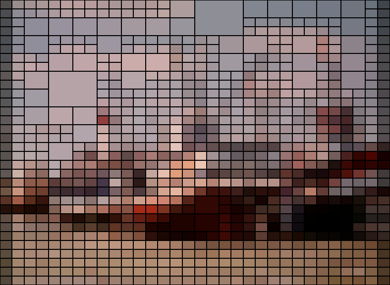
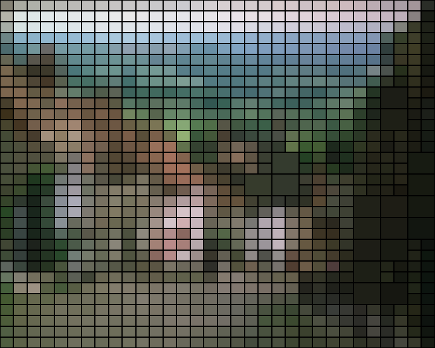

## Trabajo Práctico - Image Processing

### Objetivo

El objetivo del proyecto es desarrollar un sistema de procesamiento de imágenes que permita aplicar distintos filtros visuales de manera configurable.  
El usuario puede elegir entre dos filtros principales:

- **Voronoi**: genera una representación de la imagen mediante celdas construidas a partir de puntos semilla.
- **Mosaico**: transforma la imagen en bloques (tiles) tomando el color promedio de cada región.

Cada filtro cuenta con sus propios parámetros de entrada, los cuales el usuario puede ajustar para experimentar con diferentes configuraciones y resultados.

### Ejemplo de uso — Filtro Mosaico

Con los siguientes parámetros de entrada:

```python
variance_threshold = 150
min_size = 20
max_passes = 10
bordes = False
```

| Imagen original                    | Resultado procesado                                   |
|------------------------------------|-------------------------------------------------------|
|  |     |
|   |   |
|   |       |
|   |             |

```python
variance_threshold = 100
min_size = 30
max_passes = 5
bordes = True
```

| Imagen original                               | Resultado procesado                                   |
|-----------------------------------------------|-------------------------------------------------------|
|          |   |
|  |    |
|      |          |
|              |  |