## Image Processing — Practical Assignment

### Objective

The goal of this project is to develop an image processing system capable of applying different visual filters in a configurable way.  
The user can choose between two main filters:

- **Voronoi**: generates a representation of the image based on regions (cells) created from randomly distributed seed points.
- **Mosaic**: transforms the image into blocks (tiles), assigning each tile the average color of the pixels it contains.

Each filter includes adjustable input parameters, allowing the user to experiment with different configurations and visual results. However, during the development process, we encountered performance issues with the Voronoi filter, as it required significant processing time for larger images. To address this, we introduced an additional parameter called `speed`, which lets the user decide between higher processing speed or better image quality. When speed = True, the algorithm prioritizes faster computation, resulting in a lower-quality but quicker output. 

### Usage Example — Voronoi Filter

Using the following input parameters:

```python
n_puntos = 1000
metrica = euclidean
```

| Original Image                                      | Processed Result, speed = False                                                      |  Processed Result, speed = True                                               |
|-----------------------------------------------------|--------------------------------------------------------------------------------------| ------------------------------------------------------------------------------|
| 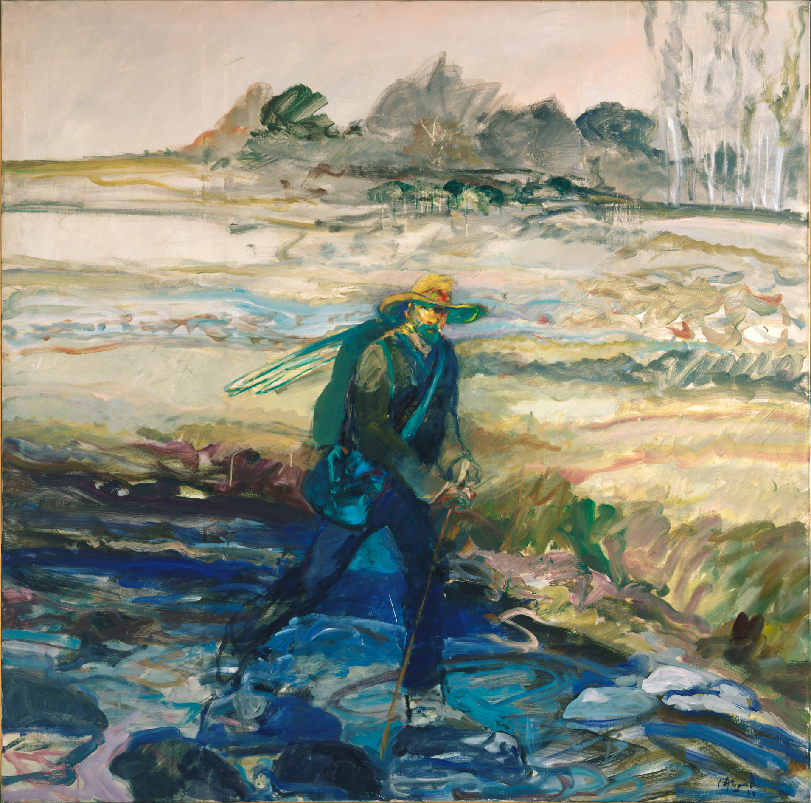             |      | 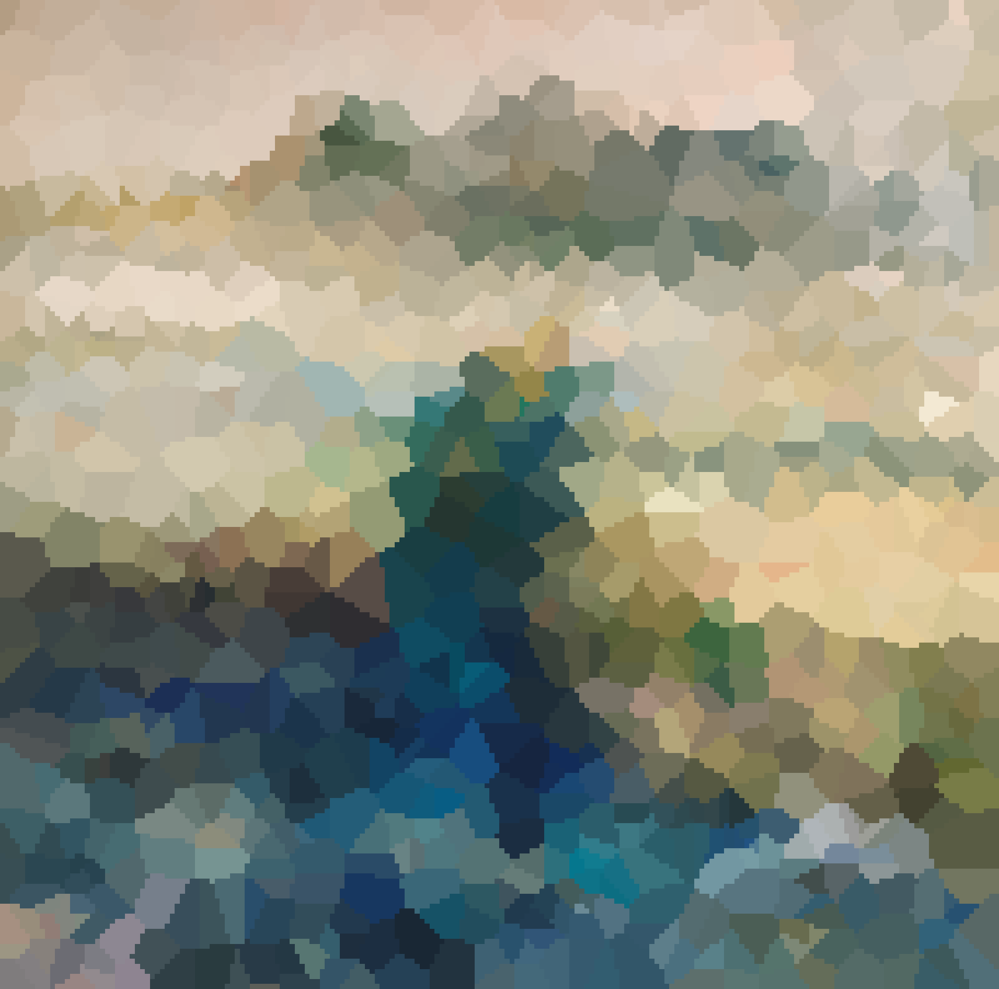               |
|  | 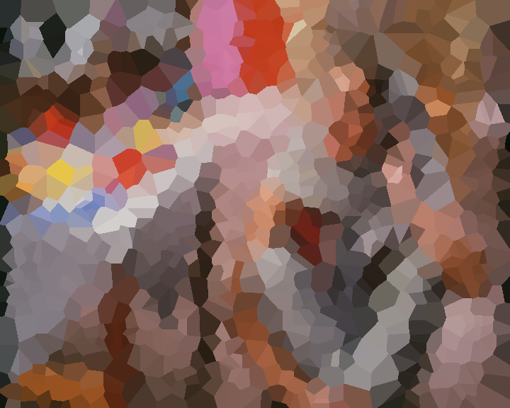   | |
| 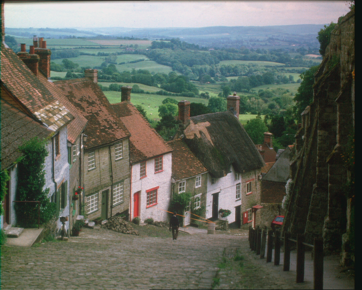           | 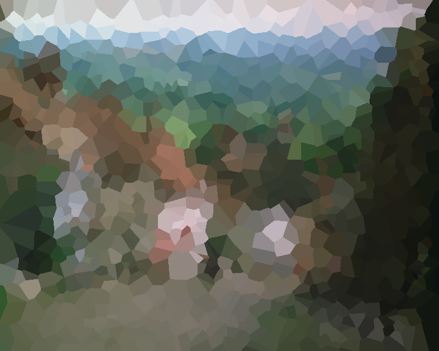 | 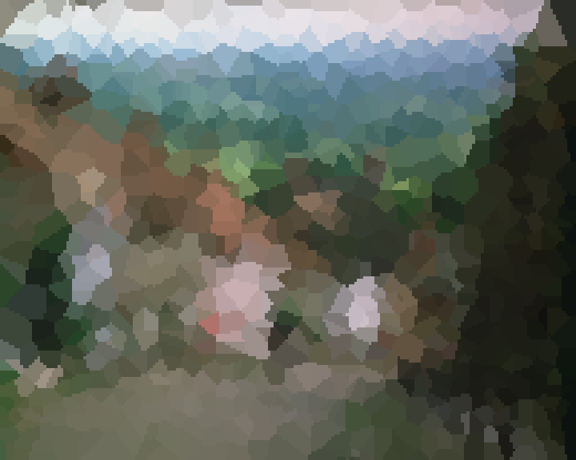 |
|                  |        | 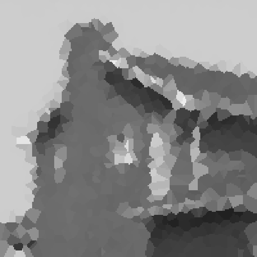 |

```python
n_puntos = 700
metrica = manhattan
```
| Original Image                           | Processed Result, speed = False                                   | Processed Result, speed = True                                  |
|------------------------------------------|-------------------------------------------------------------------|-----------------------------------------------------------------|
|      |  |  |
|      | 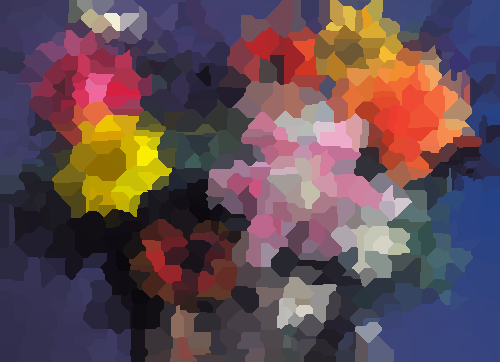 | 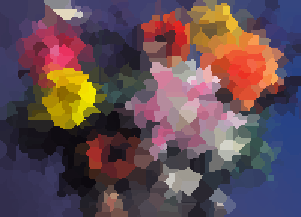 |
|        | 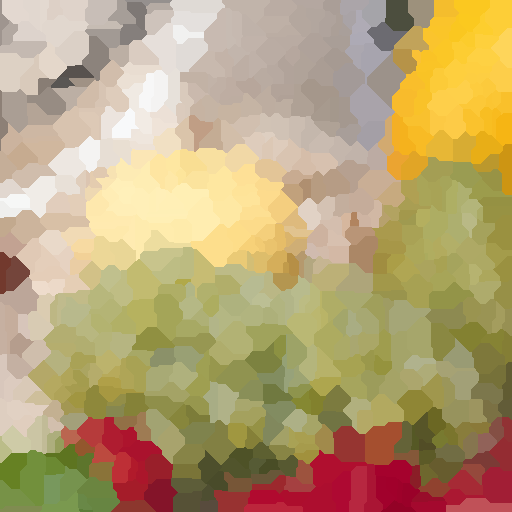   | 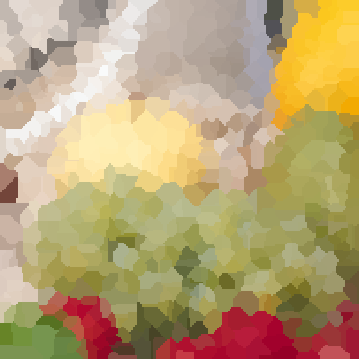   |
|      | 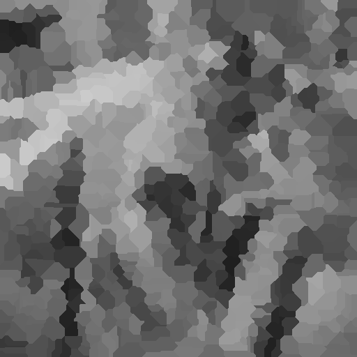 | 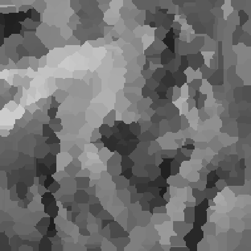 |

### Usage Example — Mosaic Filter

Using the following input parameters:

```python
variance_threshold = 150
min_size = 20
max_passes = 10
bordes = False
```

| Original Image                              | Processed Result                                     |
|---------------------------------------------|------------------------------------------------------|
| 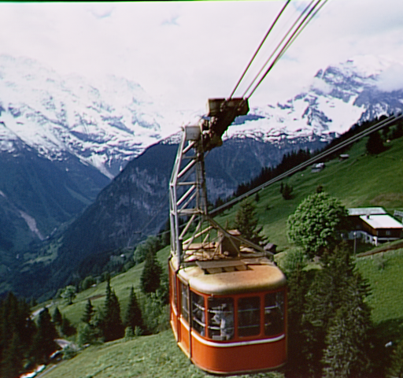   | 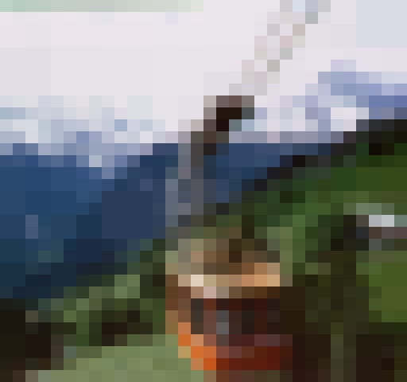   |
|  | 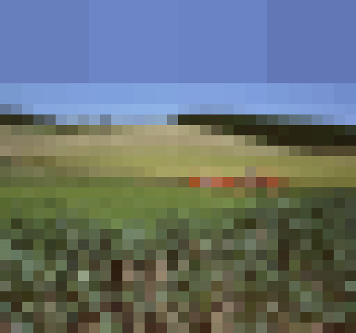 |
|      | 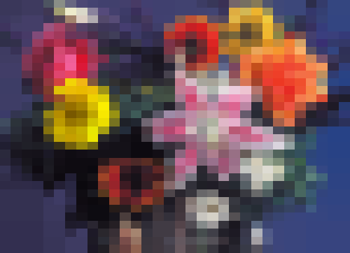   |
|            | 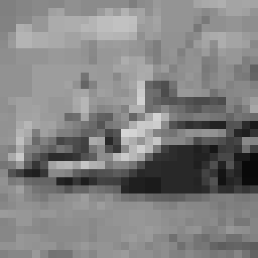         |

```python
variance_threshold = 100
min_size = 30
max_passes = 5
bordes = True
```

| Original Image                                | Processed Result                                       |
|-----------------------------------------------|--------------------------------------------------------|
|          |          |
| 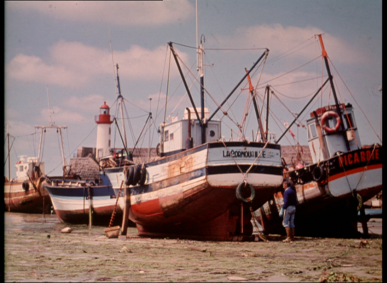 |  |
|      |      |
|              | 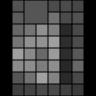             |
