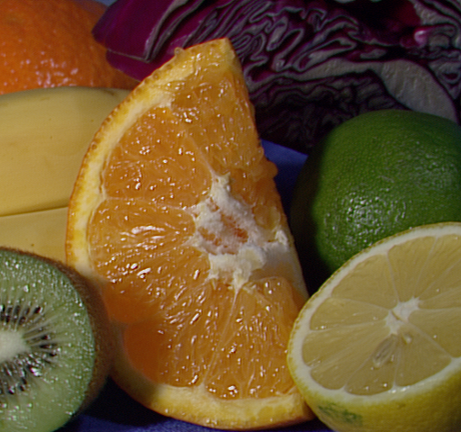
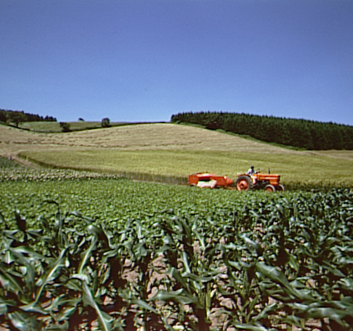
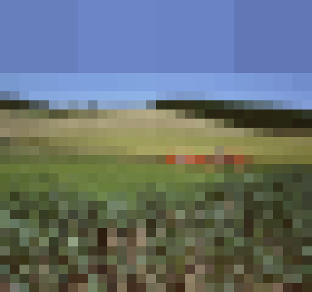
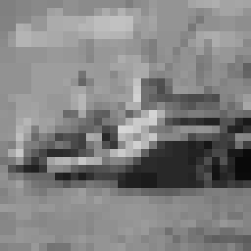
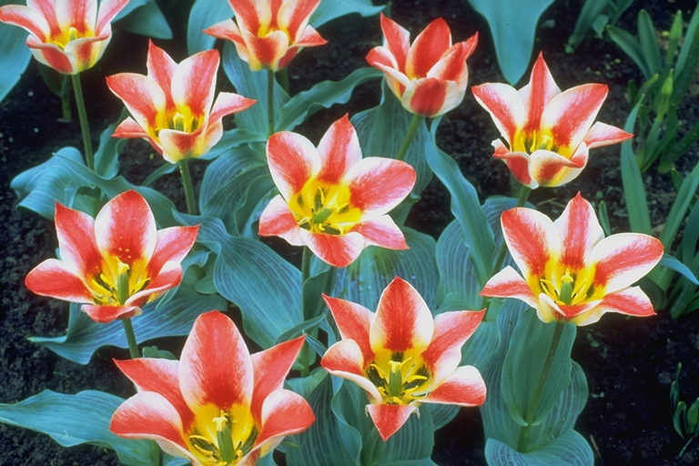
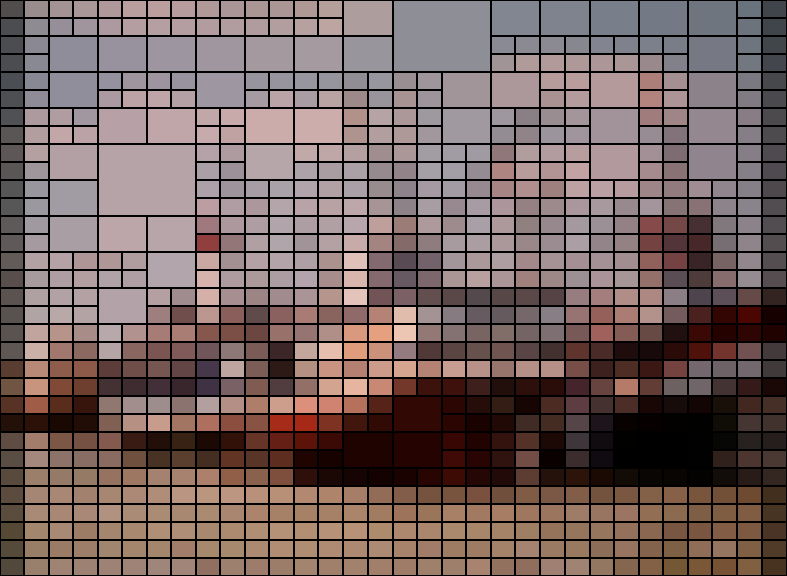
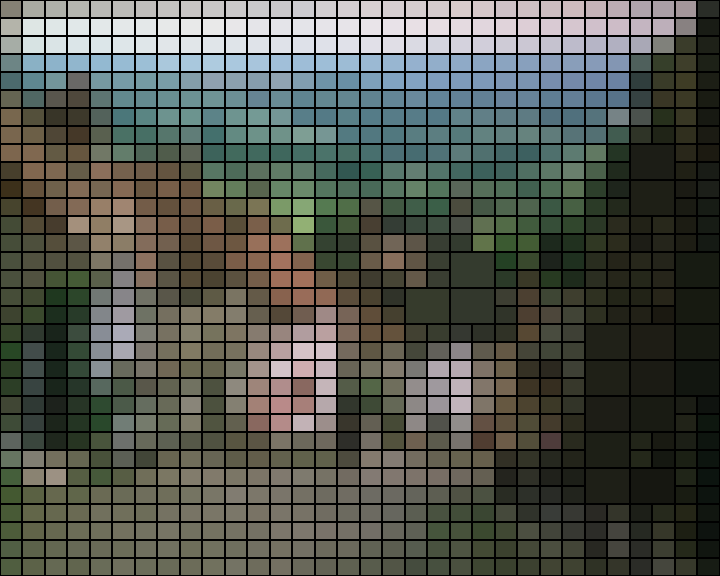
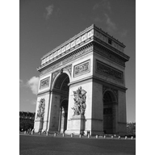
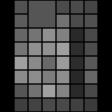

## Image Processing — Practical Assignment

### Objective

The goal of this project is to develop an image processing system capable of applying different visual filters in a configurable way.  
The user can choose between two main filters:

- **Voronoi**: generates a representation of the image based on regions (cells) created from randomly distributed seed points.
- **Mosaic**: transforms the image into blocks (tiles), assigning each tile the average color of the pixels it contains.

Each filter includes adjustable input parameters, allowing the user to experiment with different configurations and visual results.

### Usage Example — Voronoi Filter

Using the following input parameters:

```python
n_puntos = 1000
metrica = euclidean
speed = False
```

```python
n_puntos = 1000
metrica = euclidean
speed = True
```

| Original Image                                      | Processed Result                                     |
|-----------------------------------------------------|------------------------------------------------------|
|              |    |
|  |  |
|            |     |
|         |         |

```python
n_puntos = 700
metrica = manhatten
speed = True
```
| Original Image                           | Processed Result                                                 |
|------------------------------------------|------------------------------------------------------------------|
|   |   |
|   |   |
|     |     |
|   |                        |


### Usage Example — Mosaic Filter

Using the following input parameters:

```python
variance_threshold = 150
min_size = 20
max_passes = 10
bordes = False
```

| Original Image                              | Processed Result                                     |
|---------------------------------------------|------------------------------------------------------|
|    |    |
|  |  |
|      |      |
|            |            |

```python
variance_threshold = 100
min_size = 30
max_passes = 5
bordes = True
```

| Original Image                                | Processed Result                                       |
|-----------------------------------------------|--------------------------------------------------------|
|          |          |
|  |  |
|      |      |
|              |              |